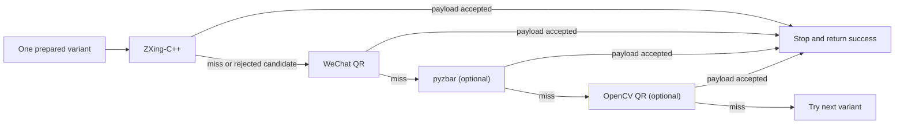
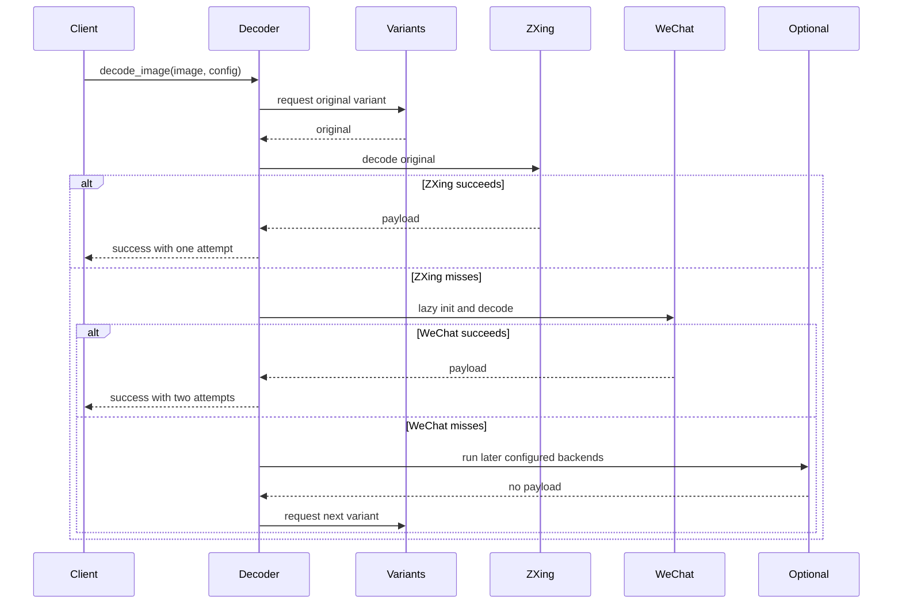
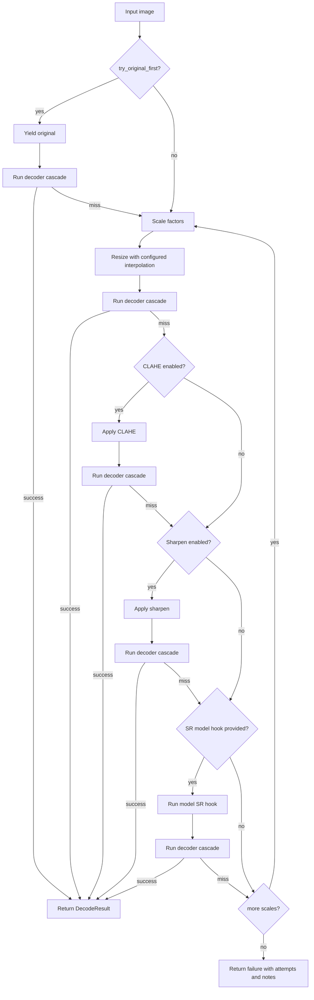

# Decoder Cascade

`zxing-cpp-sr` is a standalone side project, so it must not import
`pricetag_vision`. The cascade code here is copied/adapted from the already
tested main-repo implementations instead:

- `pricetag_vision.core.qr.UnionBarcodeDecoder`
- `pricetag_vision.core.qr_pipeline._DecoderChain`

## Backend Order

Default:

```python
DecodeConfig(backends=("zxing", "wechat"))
```



This means:

1. Try ZXing-C++ first.
2. If ZXing misses on the current variant, initialize and run WeChat QR.
3. Stop at the first valid payload.
4. Only then move to the next upscale / CLAHE / sharpen variant.

For diagnostics, the package also supports the approved main-repo fallback
families:

```python
DecodeConfig(backends=("zxing", "wechat", "pyzbar", "opencv_qr"))
```

Aliases:

| Backend | Aliases |
|---|---|
| `zxing-cpp` | `zxing`, `zxing-cpp`, `zxingcpp` |
| `wechat_qrcode` | `wechat`, `wechat_qr`, `wechat_qrcode` |
| `pyzbar` | `pyzbar`, `zbar` |
| `opencv_qr` | `opencv`, `opencv_qr`, `cv2` |

## Lazy Initialization

Fallback backends are initialized only when reached. A successful ZXing decode
does not construct WeChat, pyzbar, OpenCV QR, SR model variants, or later
upscale variants.



This mirrors the first-success behavior from `_DecoderChain` while preserving
the richer `DecodeAttempt` diagnostics used by this package.

## Variant Loop



## WeChat QR Channel Order

The main repo found and approved a critical WeChat QR fix:

```python
if crop_rgb.ndim == 3 and crop_rgb.shape[2] == 3:
    crop_in = cv2.cvtColor(crop_rgb, cv2.COLOR_RGB2BGR)
```

WeChat's CNN/SR path expects OpenCV BGR input. Passing RGB can silently reduce
recall on thermal-halftone QR crops.

In this standalone package:

- `decode_file(...)` reads with `cv2.imread`, so the default is
  `input_color="bgr"`.
- `decode_image(...)` callers that pass RGB arrays must set
  `DecodeConfig(input_color="rgb")`.
- After that boundary conversion, all internal variants are BGR or grayscale.

## Optional Dependencies

Core install:

```bash
uv pip install -e .
```

Optional pyzbar fallback:

```bash
uv pip install -e ".[pyzbar]"
```

`pyzbar` also needs the system `libzbar` shared library. If pyzbar is requested
but unavailable, the decoder records a note and continues.

## Diagnostics

Every backend pass creates a `DecodeAttempt` with:

- backend name;
- variant name and scale;
- image dimensions;
- elapsed time;
- decoded candidates;
- backend error, if a runtime failure occurred.

If a backend is unavailable before an attempt can run, it is skipped and a note
is added to `DecodeResult.notes`.
